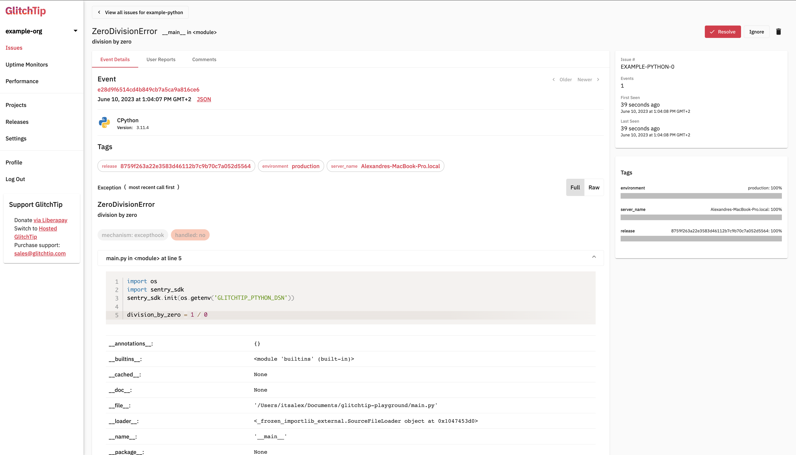

# GlitchTip playground

Playground to test GlitchTip

## Requirements

- [`docker`](https://www.docker.com/)
- [`docker-compose`](https://docs.docker.com/compose/)
- [`curl`](https://curl.se/)
- [`rtx`](https://github.com/jdxcode/rtx)
- [`docker`](https://www.docker.com/)

To integrate `rtx` and `direnv` with your shell login, you need to add hooks:

- [`rtx hooks`](https://github.com/jdxcode/rtx#quickstart)
- [`direnv hooks`](https://direnv.net/docs/hook.html)

Follow the steps below to add the hooks:

If you use **bash**, execute:
```sh
$ echo 'eval "$(~/bin/rtx activate bash)"' >> ~/.bashrc
$ echo -e "\neval "\$($(rtx which direnv) hook bash)"" >> ~/.bashrc
```
If you use **zsh**, execute:
```sh
$ echo 'eval "$(~/bin/rtx activate zsh)"' >> ~/.zshrc
$ echo -e "\neval "\$($(rtx which direnv) hook zsh)"" >> ~/.zshrc
```
Then, to apply the configuration, restart your terminal or simply execute this command:

**Bash**
```sh
$ source ~/.bashrc
```

**Zsh**
```sh
$ source ~/.zshrc
```

To set up the required tools, you need to install them locally. When you are in
the folder of the repository, use the following command:

```sh
$ rtx install
$ direnv allow
```

Install python requirements to use GlitchTip in python:

```sh
$ pip install -r requiremtens.txt
```

## Getting started

First you must launch project:

```sh
$ ./scripts/up.sh
```

Then setup GlitchTip:

```sh
$ source ./scripts/setup-glitchtip.sh
GlitchTip configured, you can now use DSN: "http://fcc3a189d6d94c30bbd33e91c1289cfa@localhost:8000/1"
```

The script [`./scripts/setup-glitchtip.sh`](./scripts/setup-glitchtip.sh) will create an account:

- Email: `user@example.com`
- Password: `fakepassword`

With a python project and give you the DSN of the project that will be
automatically be added to your environment as `GLITCHTIP_PTYHON_DSN`.

A default python project is defined in this repository to try GlitchTip. You
can now use it to send an error:

```sh
$ python main.py
```

Finally login to `http://localhost:8000` to see issue:




